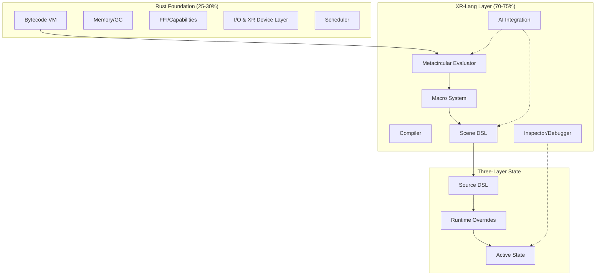
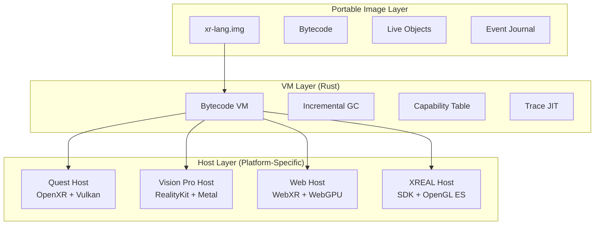

# XR-Lang: A Meta-Medium for Living Programming in XR

## Executive Summary

XR-Lang synthesizes **Lisp's homoiconicity**, **Smalltalk's live objects**, and **modern AI capabilities** to create what Alan Kay envisioned: a **meta-medium** for extended reality and 3D that can dynamically become any other medium. This document outlines the concrete path from vision to reality.

> "The best way to predict the future is to invent it." — Alan Kay

*The Smalltalk-80 environment: Everything is an object, everything is live*

## Table of Contents

1. [Core Architecture](#core-architecture)
2. [Implementation Roadmap](#implementation-roadmap)
3. [Stage A: Seed System](#stage-a-seed-system-weeks-1-4)
4. [Stage B: Homoiconic Core](#stage-b-homoiconic-core-weeks-5-8)
5. [Stage C: Live Tooling](#stage-c-live-tooling-weeks-9-12)
6. [Stage D: Meta-Programming](#stage-d-meta-programming-weeks-13-16)
7. [Stage E: AI Integration](#stage-e-ai-integration-weeks-17-20)
8. [Technical Specifications](#technical-specifications)
9. [Code Examples & Patterns](#code-examples--patterns)
10. [Resources & Inspirations](#resources--inspirations)

## Core Architecture



### Key Design Principles

XR-Lang has been praised as **"the love child of a Lisp Machine and a Smalltalk environment, raised in VR"** - this architecture embodies that vision by combining:
- **Lisp's homoiconicity and meta-programming** (code as data, macros, self-modification)
- **Smalltalk's live objects and image-based development** (always alive, inspectable, modifiable)
- **Modern AI capabilities** (conversational programming, pattern learning)
- **XR-native interaction** (3D manipulation, spatial coding)

Drawing from the lang-design-review.md recommendations:

1. **Crisp Object Model First**: Define the value graph before syntax
2. **Image + Journals**: Event-sourced persistence with time-travel
3. **Hygienic Macros**: Pattern-matching with proper scoping
4. **Capability-Based Security**: Explicit authority for all effects
5. **Probes Over Printf**: Live data visualization built into the core

## Implementation Roadmap

### Phase Distribution (from lang-design-review.md)
- **Phase 1 (MVP)**: ~45% Rust / 55% XR-Lang
- **Phase 2 (Metacircular)**: ~30% Rust / 70% XR-Lang  
- **Phase 3 (Mature)**: ~25% Rust / 75% XR-Lang

## Stage A: Seed System (Weeks 1-4)

### Concrete Tasks

#### 1. Value Model Implementation (Rust)

As experienced Lisp/Smalltalk developers emphasize, **"Keep the core language semantics as simple and regular as possible."** The value model represents the fundamental data types that XR-Lang can manipulate. Following the Lisp tradition of uniform data representation (everything is an S-expression), we start with a simple tagged union that can grow as needed:

```rust
// From lang-implementation-research.md recommendation
enum Value {
    Int(i64),
    Float(f64), 
    Str(String),
    Symbol(Symbol),
    Vector(Vec<Value>),
    Map(HashMap<String, Value>),
    Object(ObjectId),
    AST(Box<ASTNode>),  // Homoiconic foundation
}

struct RuntimeState {
    image: Image,           // Persistent state
    journal: Journal,       // Event log
    active: ActiveState,    // Current runtime
}
```

#### 2. Bytecode VM (Simple Stack-Based)

The recommendation from language design experts is to start with **"a simple evaluator or interpreter in Rust for the AST"** that prioritizes clarity over optimization. This aligns with the Lisp tradition where early implementations had minimal cores in C. The bytecode VM provides a stable execution layer that XR-Lang can eventually compile itself to:

```rust
enum OpCode {
    Push(Value),
    Pop,
    Call(Symbol),
    Return,
    Jump(usize),
    JumpIf(usize),
    // Minimal instruction set initially
}

impl VM {
    fn execute(&mut self, bytecode: &[OpCode]) -> Result<Value> {
        // 200-300 lines of simple interpreter
        // Focus on correctness over performance
    }
}
```

#### 3. S-Expression Parser

Homoiconicity is the cornerstone of Lisp's power - **"code is represented as data structures that the language itself can manipulate."** By adopting S-expressions from day one, XR-Lang inherits this meta-programming capability. The EDN-like syntax provides richer literals than traditional Lisp while maintaining the essential property that code and data share the same representation:

```lisp
; Target syntax (EDN-like as recommended)
(defscene3d demo
  (camera 
    (position 0 5 10)
    (meta preserve-runtime))  ; Metadata support from day 1
  (cube
    (position 0 0 0)))
```

#### 4. Journal + Snapshot Store

A critical lesson from Smalltalk's history is **"image drift" where the live image diverges from clean startup state**. XR-Lang's journal-based approach addresses this by maintaining an event-sourced history. This enables time-travel debugging (essential for understanding "what caused this state?") while preventing the system from becoming inconsistent:

```rust
struct Journal {
    entries: Vec<JournalEntry>,
}

enum JournalEntry {
    StateChange { 
        timestamp: u64,
        path: ValuePath,
        old: Value,
        new: Value,
    },
    Checkpoint {
        snapshot_id: SnapshotId,
    },
}

// Enable time-travel from the start
impl Journal {
    fn replay_to(&self, timestamp: u64) -> State { ... }
    fn branch_at(&self, timestamp: u64) -> Journal { ... }
}
```

#### 5. Scene Primitives and 3D Model Loading

Following the principle of **"implement the minimal low-level substrate in Rust"**, scene manipulation primitives and 3D model loading are exposed through a well-defined API bridge. This **library/engine approach** keeps the language core focused while delegating domain-specific capabilities like model parsing and rendering to pluggable components - similar to how Unity uses C# with its engine handling model import/serialization, or how WebXR/A-Frame uses JavaScript with three.js doing the actual model loading.

**Key Design Principles for 3D Model Support:**

- **Separation of Concerns**: Model loading functionality lives in the runtime library/engine rather than the language parser or core VM
- **Dual Format Strategy**: 
  - **glTF 2.0** ("the JPEG of 3D") for runtime efficiency - optimized binary format (.glb), web-friendly, widespread support
  - **USD/USDZ** ("the HTML of the metaverse") for professional workflows - industry standard backed by Pixar, NVIDIA, Apple, and the Alliance for OpenUSD (AOUSD), supporting complex scene composition, non-destructive layering, and XR/metaverse applications
- **Live Hot-Swappable Models**: Enable editing and swapping 3D assets during runtime without restarting the environment
- **Animation Primitives**: Expose embedded animations (skeletal, morph targets, USD time samples) as first-class entities that can be played, paused, sought, or blended
- **Scene Composition**: Leverage USD's powerful layering system for non-destructive scene editing and variant management

```rust
// Expose to XR-Lang as built-in functions
fn intrinsic_create_camera(pos: Vec3) -> Camera { ... }
fn intrinsic_create_cube(pos: Vec3) -> Entity { ... }
fn intrinsic_update_transform(id: EntityId, transform: Transform) { ... }

// 3D Model loading via engine bridge
fn intrinsic_load_model(path: &str) -> Result<Model> { 
    // Auto-detects format: glTF/GLB for runtime, USD/USDZ for pro workflows
    // Returns live object handle with format-specific capabilities
}
fn intrinsic_load_usd_stage(path: &str) -> Result<UsdStage> {
    // Load USD stage with full composition engine
    // Supports layers, variants, and references
}
fn intrinsic_update_model(id: ModelId, path: &str) -> Result<()> {
    // Hot-swap model at runtime
}
fn intrinsic_play_animation(model: ModelId, name: &str) { ... }
fn intrinsic_apply_usd_layer(stage: UsdStageId, layer_path: &str) { ... }
```

This approach provides several advantages:
- **Maintainability**: Updates to support new model formats happen in the engine without altering language semantics
- **Flexibility**: Users could swap out the 3D engine while keeping the language interface stable
- **Focus on Language Features**: Core language development (type system, concurrency) remains unentangled with heavy 3D logic

### Success Criteria
- [ ] Can parse and execute simple S-expressions
- [ ] Can create/modify 3D scene via DSL
- [ ] Can load and display glTF/GLB models
- [ ] Hot-reload for both code and 3D assets
- [ ] Can save/restore state via journals
- [ ] Model introspection and animation control working

## Stage B: Homoiconic Core

### Concrete Tasks

#### 6. Macro Expander in XR-Lang

Language design experts note that **"XR-Lang's use of S-expression–like syntax and macro examples shows you're leveraging homoiconicity to allow code that writes code."** This is where XR-Lang begins eating its own dogfood - implementing its macro system in itself. Hygienic macros with gensym prevent variable capture, a crucial lesson learned from decades of Lisp development:

```lisp
; First macro written in XR-Lang itself
(defmacro defscene3d [name & body]
  `(do
    (create-scene '~name)
    ~@(map expand-scene-element body)))

; Hygienic macros with gensym
(defmacro with-preserved-state [& body]
  (let [state# (gensym "state")]
    `(let [~state# (capture-state)]
       (try
         ~@body
         (finally
           (restore-state ~state#))))))
```

#### 7. Metacircular Evaluator

This is the heart of Lisp's elegance - **"a function in XR-Lang that can interpret XR-Lang code, running on top of the base interpreter."** The metacircular evaluator proves the language is complete and self-describing. As language designers explain, "if you can implement many of its features in itself, the language is truly powerful." This milestone means XR-Lang understands itself:

```lisp
; The evaluator evaluating itself - the Lisp tradition
(defn eval [expr env]
  (cond
    (symbol? expr) (lookup expr env)
    (number? expr) expr
    (string? expr) expr
    (vector? expr) (eval-vector expr env)
    (list? expr) 
    (case (first expr)
      'quote (second expr)
      'if (if (eval (second expr) env)
            (eval (third expr) env)
            (eval (fourth expr) env))
      'lambda (make-closure (second expr) (cddr expr) env)
      'defmacro (install-macro! (second expr) (third expr) (cdddr expr))
      ; ... more special forms
      (apply (eval (first expr) env)
             (map #(eval % env) (rest expr))))))
```

#### 8. Compiler to Bytecode

The recommended phased approach is: **"Phase 1: AST interpreter in Rust (baseline), Phase 2: XR-Lang-level optimizations, Phase 3: Bytecode compiler in XR-Lang."** Writing the compiler in XR-Lang itself allows for sophisticated optimizations and proves the language's maturity. This follows the Lisp tradition where compilers are often written in the language they compile:

```lisp
(defn compile-expr [expr]
  (cond
    (literal? expr) [(push expr)]
    (symbol? expr) [(load expr)]
    (if? expr) (compile-if expr)
    (lambda? expr) (compile-lambda expr)
    (application? expr) (compile-app expr)))

(defn compile-to-bytecode [ast]
  (flatten (map compile-expr ast)))
```

#### 9. Selective Persistence Policies

Addressing Smalltalk's "image drift" problem, XR-Lang's hybrid approach is praised by language experts: **"It lets you preserve interactive tweaks (active state) without losing the canonical definitions (source DSL)."** This three-layer system ensures developers can explore and tweak in real-time without fear of corrupting the base system - combining the best of image-based and file-based development:

```lisp
; Implementing the three-layer state system
(defmacro with-meta [obj & metadata]
  `(attach-metadata ~obj ~(apply hash-map metadata)))

(defn apply-persistence-policy [obj]
  (case (:meta obj)
    :preserve-runtime (preserve-in-journal obj)
    :sync-to-code (schedule-code-sync obj)
    :volatile nil
    :reset (reset-on-reload obj)))
```

### Success Criteria
- [ ] Macro system working with hygiene
- [ ] Can evaluate XR-Lang in XR-Lang
- [ ] Compiler generates valid bytecode
- [ ] Persistence policies functional

## Stage C: Live Tooling

### Concrete Tasks

#### 10. 3D Inspector (Smalltalk-style Halos)

**"Powerful Introspection & Reflection"** is emphasized as a must-have feature from Lisp and Smalltalk. The 3D inspector extends Smalltalk's morphic halos into XR space - allowing developers to point at any 3D object and instantly see its code, state, and history. This deep, live introspection makes the system transparent and debuggable:

```lisp
(defn create-inspector-halo [object]
  (spawn-ui-ring
    {:inspect (fn [] (show-object-state object))
     :code (fn [] (show-object-code object))
     :timeline (fn [] (show-object-history object))
     :probes (fn [] (attach-probe object))}))

; Visual probes as first-class citizens
(defprobe vector-visualizer [vec]
  (draw-arrow (origin) vec (magnitude vec)))

(defprobe value-gauge [value min max]
  (draw-arc value min max))
```

*Morphic halos in Squeak Smalltalk - direct manipulation of live objects (although only in 2D):*


#### 11. Omnibox REPL

Extending the traditional REPL concept: **"Lisp and Smalltalk environments traditionally revolve around a REPL or workspace where you 'converse' with the system."** XR-Lang takes this further with an omnibox that understands intent - not just evaluating code but searching, creating, and even invoking AI assistance:

```lisp
(defn omnibox-eval [input]
  (match (parse-intent input)
    [:eval code] (eval code)
    [:search pattern] (find-in-scene pattern)
    [:create description] (ai-generate-object description)
    [:help topic] (show-help topic)))
```

#### 12. Time Machine UI for live debugging

Core feature of XR-Lang is **"Interactive Debugging & Time Travel"** - being able to scrub through the history of changes addresses "what caused this state?", a perennial debugging question. This goes beyond traditional debuggers by making time itself a navigable dimension, crucial for understanding complex AI-generated code:

```lisp
; Low-level time-travel hooks - the foundation
(defprotocol TimeCapture
  (capture-frame [state timestamp])
  (interpolate-between [state1 state2 t])
  (diff-states [before after])
  (branch-timeline [base-time variation]))

; Core time-travel engine with customizable hooks
(deftimeengine default-engine
  :capture-rate 60  ; fps
  :max-history 10000  ; frames
  :interpolation :cubic-bezier
  
  ; Hook: What state to capture each frame
  (on-capture [world]
    {:objects (get-all-transforms world)
     :properties (get-all-properties world)
     :events (get-frame-events world)})
  
  ; Hook: How to visualize state differences
  (on-visualize-diff [before after]
    (generate-ghost-trails before after))
  
  ; Hook: Custom interpolation for smooth scrubbing
  (on-interpolate [frames target-time]
    (bezier-interpolate frames target-time)))

; High-level timeline UI component (customizable)
(defcomponent timeline-scrubber
  :engine default-engine  ; Use specific engine
  
  (state [current-time (now)
          playback-speed 1.0
          selected-objects #{}
          parameter-variations {}])
  
  ; Multi-dimensional scrubbing (time + parameters)
  (on-scrub [time-position param-values]
    ; Travel through time
    (travel-to! time-position)
    
    ; Generate parameter variation ghosts
    (for [param param-values]
      (spawn-ghost-timeline param))
    
    ; Show state graphs for selected objects
    (update-state-graphs selected-objects time-position))
  
  ; Visualization layers
  (render []
    (layer :timeline
      (draw-timeline-rail
        (mark-checkpoints)
        (show-branches)
        (indicate-current-time)))
    
    (layer :variations
      ; Like the robot paths example - show multiple variations
      (for [variation (get-parameter-variations)]
        (draw-ghost-path variation :opacity 0.3)))
    
    (layer :graphs
      ; Like the histogram graphs in the first image
      (for [property (get-tracked-properties)]
        (draw-property-graph property :over-time)))
    
    (layer :trails
      ; Like Mario's jump trail - persistent visualization
      (for [object selected-objects]
        (draw-motion-trail object :history-length 100)))))

; Custom 3D time-travel debugger for physics simulation
(deftimeline-debugger physics-debugger
  :extends timeline-scrubber
  
  ; Custom capture for physics-specific data
  (on-capture [world]
    (merge (super world)
           {:velocities (get-all-velocities world)
            :forces (get-all-forces world)
            :collisions (get-frame-collisions world)}))
  
  ; 3D visualization of force vectors over time
  (on-render-3d [time-slice]
    (for [object (get-physics-objects time-slice)]
      (draw-3d-vector (get-position object)
                      (get-velocity object)
                      :color :blue)
      (draw-3d-vector (get-position object)
                      (get-force object)
                      :color :red)))
  
  ; Parameter variation for initial conditions
  (on-parameter-vary [param-name range]
    ; Like the angle variation in the robot example
    (parallel-timelines
      (for [value range]
        (simulate-with param-name value)))))

; Behavior-specific debugger with custom visualizations
(deftimeline-debugger behavior-debugger
  :extends timeline-scrubber
  
  ; Track behavior state machines
  (on-capture [entity]
    {:behavior-state (get-current-state entity)
     :behavior-transitions (get-recent-transitions entity)
     :behavior-stack (get-behavior-stack entity)})
  
  ; Visualize state machine evolution over time
  (on-render-timeline [history]
    (draw-state-machine-evolution history))
  
  ; Show all possible execution paths
  (on-branch-preview [current-state possible-inputs]
    (for [input possible-inputs]
      (preview-execution-branch current-state input))))

; Usage: Declarative time-travel debugging setup
(defscene3d debugging-workspace
  ; Built-in scrubber with default settings
  (timeline-scrubber :id :main-scrubber)
  
  ; Custom debugger for specific subsystem
  (physics-debugger 
    :id :physics-debug
    :target-objects [(get-entities-with-tag :physics)])
  
  ; Multiple synchronized timelines
  (synchronized-debuggers
    [(behavior-debugger :track :ai-agents)
     (animation-debugger :track :characters)
     (particle-debugger :track :effects)]))

; Future high-level abstractions (what users will actually write):
; Just one line to make any object debuggable!

(defscene3d game-world
  ; Simple one-liner to add time-travel debugging
  (cube 
    (position 0 0 0)
    (debug-time-travel))  ; That's it! Full debugging enabled
  
  ; Or attach debugging with custom visualization
  (physics-ball
    (position 5 0 0)
    (debug-with :physics-debugger))  ; Use specialized debugger
  
  ; Global time-travel UI summoned with gesture/key
  (on-gesture :debug-mode
    (toggle-time-machine))  ; Show/hide the UI
  
  ; Even simpler - automatic debugging in dev mode
  (meta :debug-all-in-dev true))

; The abstraction will expand to rich functionality:
; (debug-time-travel) automatically generates:
; - Timeline scrubber for this object
; - Motion trails when selected
; - State history graphs
; - Parameter variation ghosts
; - All connected to a global time-travel UI
```

As Bret Victor describes in his talk[ "Inventing on Principle"](https://www.youtube.com/watch?v=PUv66718DII) – why not show the effects of predicted changes, and change over time? Time is the missing element in a static display of code and rendered output:


### Success Criteria
- [ ] Can inspect any object in 3D space
- [ ] Probes provide live data visualization
- [ ] Time travel with visual feedback
- [ ] REPL integrated in 3D world
- [ ] Low-level hooks to support building custom time travel debuggers in 3D space and XR space
- [ ] Example custom time travel debugger in 3D space that leverages implemented tooling (testing the full functionality)

## Stage D: Meta-Programming

### Concrete Tasks

#### 13. Source Rewriter

Experienced language designers warn about **"Metaprogramming Safety & Clarity"** - with self-modifying code comes great responsibility. XR-Lang addresses this with provenance tracking and annotations, ensuring every transformation is traceable. As noted: "establishing conventions for generated code will help developers distinguish human-written from AI/macro-written code":

```lisp
(defn rewrite-source! [ast-path new-ast]
  ; Safely modify source with provenance tracking
  (let [current (read-source)
        modified (update-in current ast-path (constantly new-ast))
        annotated (add-metadata modified
                    {:timestamp (now)
                     :author (current-author)
                     :generated (is-ai-generated? new-ast)})]
    (write-source! annotated)
    (hot-reload!)))

; Example: Interactive evolution
(defmacro evolve-on-click [object]
  `(on-click ~object
     (let [current-code (get-source ~object)
           evolved (ai-evolve-behavior current-code)]
       (rewrite-source! (path-to ~object) evolved))))
```

#### 14. Pattern Recorder

Beyond traditional macro recording, this implements **"Pattern detection and learning"** - the system observes user interactions and generates reusable macros. This bridges the gap between direct manipulation (Smalltalk's strength) and symbolic programming (Lisp's domain), making the language learn from how it's used:

```lisp
(defn record-interaction-pattern []
  (start-recording!)
  ; User performs actions...
  (let [pattern (analyze-recording)]
    (generate-macro-from-pattern pattern)))

; Generated macro example
(defmacro bounce-and-spin [object]
  `(parallel
     (animate ~object :position (bounce-curve 2.0))
     (animate ~object :rotation (spin 360))))
```

#### 15. Visual Shader Compiler

**"Visual Representations of Code Structures"** is mentioned as a key feature for 3D IDEs. This shader compiler exemplifies dual representation - visual nodes for intuitive editing, compiled to efficient code. It's reminiscent of LabVIEW or Unreal Blueprints, but now in an immersive environment where the visual and textual remain synchronized:

```lisp
; 3D nodes compile to WGSL
(defn compile-shader-graph [nodes edges]
  (-> (build-dependency-graph nodes edges)
      (topological-sort)
      (generate-wgsl)
      (optimize-shader)))

; Interactive shader editing
(defbehavior shader-workshop
  (on-connect [node1 node2]
    (let [shader (compile-shader-graph (get-all-nodes))]
      (hot-reload-shader! shader)
      (preview-on-object shader))))
```

### Success Criteria
- [ ] Can modify own source code
- [ ] Pattern recording generates macros
- [ ] Visual programming compiles to code
- [ ] Safe code generation with provenance

## Stage E: AI Integration

### Concrete Tasks

#### 16. AI as Tool (Capability-Based)

AI integration is seen as **"taking the REPL to the next level by literally conversing with an AI agent in the language."** Using capability-based security ensures AI assistance remains controlled and auditable. This transforms the traditional human-computer interaction into a true partnership, where the AI can "assist in writing new macros or even modify the language itself":

```lisp
(defcapability ai-generate
  :requires [:network :compute]
  :quota 1000  ; requests per day
  :audit true)

(defn ai-generate-dsl [description context]
  (with-capability ai-generate
    (-> (create-prompt description context)
        (send-to-ai-service)
        (parse-response)
        (validate-safety)
        (present-as-diff))))
```

#### 17. Conversational Programming

Extending beyond traditional REPLs, this is **"akin to having a supercharged REPL that not only evaluates code but also writes code alongside you."** The persistent memory ensures the AI learns from each session, building context over time - a crucial evolution from stateless command interfaces:

```lisp
(defai assistant
  :model "claude-3-opus"
  :memory (persistent-store "assistant.mem")
  :personality "collaborative precise creative"
  
  (on-request [intent context]
    (case (:type intent)
      :generate (generate-code-proposal intent context)
      :explain (explain-with-visualization intent context)
      :evolve (suggest-evolution-path intent context)
      :debug (analyze-problem intent context))))
```

#### 18. Explainable Meta-Programming

Addressing the concern that **"Lisp macros and self-evolution can produce inscrutable code if not managed,"** XR-Lang makes every transformation visualizable and understandable. This transparency is essential when AI generates code - developers must be able to trust but verify what's happening:

```lisp
(defn explain-transformation [before after]
  (let [diff (semantic-diff before after)
        explanation (ai-explain-changes diff)
        visualization (animate-ast-transformation before after)]
    (present-explanation
      {:visual visualization
       :textual explanation
       :confidence (ai-confidence-score)
       :alternatives (generate-alternatives)})))
```

#### Watch Bret Victor's "Inventing on Principle"

[](https://www.youtube.com/watch?v=PUv66718DII)

*Essential viewing: Bret Victor demonstrates immediate connection between creators and creation*

### Success Criteria
- [ ] AI generates valid DSL code
- [ ] Natural language scene modification
- [ ] Every AI action explainable
- [ ] Persistent learning across sessions

## Technical Specifications

### Language Syntax (S-Expressions/EDN)

Language experts celebrate seeing **"S-expression–like syntax"** as it provides the foundation for homoiconicity. By choosing EDN (Extensible Data Notation) over pure S-expressions, XR-Lang gains richer literal syntax for maps, vectors, and sets while maintaining the crucial property that **"code is represented as data structures that the language itself can manipulate"**:

```lisp
; Core syntax - homoiconic from the start
(def value 42)
(defn function [x] (* x 2))
(defmacro macro [x] `(list ~x))

; Data literals
{:map "value" :key 2}      ; Maps
[1 2 3]                     ; Vectors  
#{1 2 3}                    ; Sets
'(1 2 3)                    ; Lists

; Metadata
^{:doc "Camera that preserves position"}
(camera
  (position 0 5 10)
  (meta preserve-runtime))
```

### Value Model Specification

```rust
// Comprehensive value system from day one
pub enum Value {
    // Primitives
    Nil,
    Bool(bool),
    Int(i64),
    Float(f64),
    Str(String),
    Symbol(Symbol),
    Keyword(Keyword),
    
    // Collections
    List(List<Value>),
    Vector(Vec<Value>),
    Map(HashMap<Value, Value>),
    Set(HashSet<Value>),
    
    // Special
    AST(ASTNode),           // Code as data
    Object(ObjectId),       // Scene objects
    Closure(Closure),       // Functions
    Macro(Macro),          // Macros
    
    // Extended
    Capability(Capability), // Security
    Channel(Channel),       // Concurrency
}
```

### Persistence Model

```rust
// Event-sourced architecture
pub struct PersistenceLayer {
    // Immutable snapshots
    snapshots: SnapshotStore,
    
    // Event journal
    journal: Journal,
    
    // Active branches
    branches: HashMap<BranchId, Journal>,
    
    // Conflict resolution
    merger: ConflictMerger,
}

pub struct JournalEntry {
    timestamp: u64,
    author: Author,
    change: Change,
    provenance: Provenance,  // Human/AI/Generated
}
```

### Scene Graph Integration

Following the principle to **"implement the minimal low-level substrate in Rust and high-level logic in XR-Lang,"** the scene DSL demonstrates clear separation of concerns. The Entity-Component-System architecture maps naturally to both functional programming (systems as functions over components) and the live object manipulation that Smalltalk pioneered:

```lisp
; Scene DSL compiles to ECS
(defscene3d my-world
  ; Entities with components
  (entity camera
    (transform :position [0 5 10])
    (camera-component :fov 60)
    (meta :preserve-runtime true))
  
  (entity cube
    (transform :position [0 0 0])
    (mesh-component :type :cube)
    (material-component :color [1 0 0])
    (behavior rotate-on-click))
  
  ; Loading 3D models as first-class entities
  (entity character
    (model :path "assets/character.glb"
             :hot-reload true)
    (transform :position [5 0 5])
    (animation :clip "idle" :loop true)
    (behavior interactive-character)))

; Behaviors as systems
(defsystem rotate-on-click
  :components [transform clickable]
  :on-click (fn [entity]
    (update-component entity :transform
      (fn [t] (rotate t :y 45)))))

; Model hot-swapping and animation control
(defsystem interactive-character
  :components [model animation]
  :on-proximity (fn [entity distance]
    (if (< distance 2.0)
      (play-animation entity "wave")
      (play-animation entity "idle")))
  :on-edit (fn [entity new-model-path]
    ; Hot-swap model without restart
    (reload-model! entity new-model-path)))
```

### 3D Model Loading Architecture

The 3D model loading system follows a **bridge pattern** that decouples the language from specific 3D APIs, supporting both **glTF** for runtime efficiency and **USD** for professional workflows:

```lisp
; High-level XR-Lang API for models
(defprotocol ModelLoader
  (load-model [path options])
  (reload-model [model path])
  (get-animations [model])
  (get-nodes [model])
  (find-node [model name]))

; USD-specific protocol for advanced composition
(defprotocol UsdComposer
  (load-stage [path])
  (add-layer [stage layer-path strength])
  (set-variant [stage prim-path variant-name])
  (get-prims [stage])
  (compose-scene [stage time]))

; Implementation delegates to engine - format auto-detection
(defn load-model [path & {:keys [hot-reload format]}]
  (let [format (or format (detect-format path))]
    (case format
      :gltf (load-gltf path :hot-reload hot-reload)
      :usd (load-usd-stage path :hot-reload hot-reload)
      :usdz (load-usdz-archive path :hot-reload hot-reload))))

; glTF loader - optimized for runtime
(defn load-gltf [path & opts]
  (let [model (engine/load-gltf path)
        animations (engine/get-gltf-animations model)]
    {:format :gltf
     :model model
     :animations animations
     :nodes (build-node-map model)
     :hot-reload (:hot-reload opts)
     :watcher (when (:hot-reload opts)
                (watch-file path #(reload-model model %)))}))

; USD loader - full composition support
(defn load-usd-stage [path & opts]
  (let [stage (engine/open-usd-stage path)]
    {:format :usd
     :stage stage
     :prims (get-stage-prims stage)
     :layers (get-composition-layers stage)
     :variants (extract-variant-sets stage)
     :time-samples (get-time-sample-range stage)
     :hot-reload (:hot-reload opts)}))

; Live introspection works for both formats
(defn inspect-model [model]
  (spawn-inspector
    (merge
      {:nodes (get-all-nodes model)
       :materials (get-materials model)
       :animations (get-animation-clips model)
       :stats {:vertices (count-vertices model)
               :triangles (count-triangles model)}}
      ; USD-specific introspection
      (when (= (:format model) :usd)
        {:layers (get-layers (:stage model))
         :variants (get-variant-sets (:stage model))
         :composition-arcs (analyze-composition (:stage model))}))))

; USD Scene Composition - leveraging layering system
(defn compose-usd-scene [base-stage & overlays]
  (reduce (fn [stage overlay]
            (case (:type overlay)
              :layer (add-sublayer stage (:path overlay) (:strength overlay))
              :variant (set-variant-selection stage (:prim overlay) (:variant overlay))
              :reference (add-reference stage (:prim overlay) (:ref-path overlay))
              :payload (add-payload stage (:prim overlay) (:payload-path overlay))))
          base-stage
          overlays))
```

## Code Examples & Patterns

### Example 1: Self-Modifying Scene

A key insight from language design is that **"the ultimate meta-circular dream is an XR-Lang that can rebuild its entire self from scratch using itself."** This example demonstrates that vision in miniature - a scene that rewrites its own source code based on interaction patterns, embodying the Lisp tradition of programs that write programs:

```lisp
; A scene that evolves based on interaction
(defscene3d evolving-world
  (entity evolution-controller
    (meta :hidden true)
    (behavior
      (on-interaction [pattern]
        (let [new-entity (learn-from-pattern pattern)]
          ; Add new entity to our own source
          (rewrite-source! 
            (path-to-scene 'evolving-world)
            (add-entity (current-source) new-entity))))))
  
  ; Entities learn and adapt
  (entity adaptive-cube
    (transform :position [0 0 0])
    (mesh :type :cube)
    (behavior
      (on-click []
        (let [my-behavior (get-my-behavior)
              evolved (evolve-behavior my-behavior)]
          ; Rewrite own behavior
          (rewrite-source! (path-to-me) evolved))))))
```

### Example 2: AI Pair Programming

This has been described as **"the love child of a Lisp Machine and a Smalltalk environment, raised in VR and trained by GPT-4."** This conversational programming example shows how natural language becomes another way to write code, with the AI understanding context and generating both immediate solutions and reusable patterns:

```lisp
(defconversation creative-session
  (human "Make something that responds to sound")
  
  (ai "I'll create an audio-reactive particle system. 
       What kind of mood are you going for?")
  
  (human "Ethereal and flowing, like northern lights")
  
  (ai (generate-code
    '(defentity aurora-particles
       (particle-system
         :count 1000
         :emitter (curve-emitter :wave)
         :color (gradient "#00ff00" "#0000ff" "#ff00ff"))
       (behavior audio-reactive
         (on-audio-frame [fft]
           (let [bass (get-frequency-band fft :bass)
                 treble (get-frequency-band fft :treble)]
             (update-particles
               :turbulence (* bass 2.0)
               :color-shift treble)))))))
  
  (human "Perfect! Make it a reusable pattern")
  
  (ai (generate-macro
    '(defmacro aurora-reactive [name & opts]
       `(defentity ~name
          (particle-system ~@(merge default-aurora opts))
          (behavior audio-reactive
            ~(generate-audio-behavior opts))))))
```

### Example 3: Visual Shader Programming

A key principle is **"keeping such visual editing in sync with textual code so that one can fluidly switch between them."** This shader example demonstrates dual representation - visual nodes for intuitive creation, textual code for precision, with hot-reload providing immediate feedback:

```lisp
(defshader-graph plasma-shader
  ; Nodes defined visually, compile to WGSL
  (input uv :type :vec2)
  (input time :type :float)
  
  (node sine1 
    :op :sin
    :input (* uv.x 10.0))
  
  (node sine2
    :op :sin  
    :input (+ (* uv.y 10.0) time))
  
  (node combine
    :op :add
    :inputs [sine1 sine2])
  
  (output color
    :value (vec4 combine 0.5 1.0)))

; Interactive compilation
(on-edit shader-graph
  (let [wgsl (compile-to-wgsl shader-graph)]
    (hot-reload-shader! wgsl)
    (preview-on-sphere wgsl)))
```

### Example 4: Time-Travel Debugging

As strongly advocated by language design experts: **"The timeline/time-travel idea is fantastic – being able to scrub through the history of changes and see the state of the world at any moment addresses the perennial question 'what caused this state?'"** This example shows branching timelines, allowing experimentation without fear:

```lisp
(deftimeline my-timeline
  ; Every change is recorded
  (checkpoint :start)
  
  (at 1000 (create-cube :pos [0 0 0]))
  (at 2000 (move-cube :to [5 0 0]))
  (at 3000 (branch :experiment
    (at 3100 (scale-cube 2.0))
    (at 3200 (color-cube :red))))
  
  ; Main timeline continues
  (at 4000 (rotate-cube :y 45)))

; Navigate through time
(travel-to! 2500)  ; Between move and branch
(show-diff 2000 3000)  ; What changed?
(merge-branch :experiment :resolve-conflicts-visually)
```

### Example 5: Live Pattern Language

A key insight is how **"XR-Lang might script the AI interactions using XR-Lang primitives"** - here, the system learns from user interactions to create new language constructs. This embodies the principle that the language should be able to extend itself based on how it's actually used:

```lisp
; Record interactions to create patterns
(start-pattern-recording!)

; User manipulates objects...
; Clicks cube, drags to position, adds rotation

(stop-pattern-recording!)

; AI analyzes and generates pattern
(defpattern place-and-spin
  :description "Position object and add rotation"
  :parameters [object target-pos spin-rate]
  :actions
  [(move-to object target-pos :duration 1.0)
   (add-behavior object 
     (spin :axis :y :rate spin-rate))])

; Pattern becomes first-class language construct
(apply-pattern place-and-spin my-cube [10 0 10] 2.0)
```

### Example 6: Hot-Swappable 3D Models with Live Editing

Demonstrating the **liveness principle** applied to 3D assets - models can be edited externally and changes reflect immediately without restarting:

```lisp
(defscene3d live-modeling-workspace
  ; Load model with hot-reload enabled
  (entity robot
    (model :path "assets/robot.glb"
           :hot-reload true
           :watch-interval 500)  ; Check for changes every 500ms
    (transform :position [0 0 0])
    (meta :preserve-state true))  ; Preserve position/rotation on reload
  
  ; Interactive model swapping
  (entity model-gallery
    (layout :grid [3 3])
    (for [model-path (list-models "assets/characters/")]
      (preview-model model-path
        :on-select (fn [path]
          ; Instantly swap the main model
          (swap-model! robot path)))))
  
  ; Animation blending and control
  (behavior animation-controller
    :target robot
    :on-update (fn [entity dt]
      (let [current-anim (get-current-animation entity)
            target-anim (determine-animation-state entity)]
        (when (not= current-anim target-anim)
          ; Smooth transition between animations
          (blend-to-animation entity target-anim 
                            :duration 0.3
                            :curve :ease-in-out))))))

; File watcher for external edits
(defwatcher model-updater
  :watch-paths ["assets/*.glb" "assets/*.gltf"]
  :on-change (fn [path event]
    (case event
      :modified (reload-all-using path)
      :created (add-to-asset-browser path)
      :deleted (remove-from-scene path)))
  :debounce 100)  ; Avoid multiple reloads

; Live material editing
(defn edit-model-material [model material-name new-properties]
  (let [material (find-material model material-name)]
    ; Changes apply immediately to rendered model
    (update-material! material new-properties)
    ; Optionally save back to file
    (when (:save-to-disk new-properties)
      (export-material-changes model))))
```

### Example 7: Model Introspection and Manipulation

Showing how the language provides **deep access to model internals** for fine-grained control:

```lisp
(defn explore-model [model-path]
  (let [model (load-model model-path)]
    ; Access model hierarchy
    (println "Model structure:")
    (walk-nodes model 
      (fn [node depth]
        (println (str (repeat "  " depth) 
                     (:name node) 
                     " [" (:type node) "]"))))
    
    ; List all animations with metadata
    (println "\nAnimations:")
    (for [anim (get-animations model)]
      (println (format "  %s: %.2fs, %d keyframes"
                      (:name anim)
                      (:duration anim)
                      (:keyframe-count anim))))
    
    ; Find and modify specific parts
    (when-let [wheel (find-node model "front_wheel")]
      (add-behavior wheel
        (spin :axis :x :rate 2.0)))
    
    ; Access and modify materials
    (for [material (get-materials model)]
      (when (= (:type material) :pbr)
        (update-material! material
          {:metallic 0.8
           :roughness 0.2})))
    
    model))

; Advanced: Procedural animation from model data
(defn create-procedural-animation [model animation-name]
  (let [bones (get-bones model)
        ; Extract animation primitives
        base-animation (get-animation model animation-name)
        keyframes (extract-keyframes base-animation)]
    
    ; Generate variations programmatically
    (for [variation-id (range 5)]
      (let [modified-keyframes 
            (map (fn [kf]
                   (update kf :rotation
                           #(add-noise % (* variation-id 0.1))))
                 keyframes)]
        (create-animation! model
          (str animation-name "-var-" variation-id)
          modified-keyframes)))))
```

### Example 8: USD Scene Composition and Layering

Demonstrating **USD's powerful composition engine** for non-destructive scene assembly and variant management - the foundation for metaverse content:

```lisp
(defscene3d usd-composition-workspace
  ; Load base USD stage (like Pixar uses in production)
  (stage main-stage
    :path "assets/environments/city.usd"
    :purpose :base)
  
  ; Layer multiple USD files non-destructively
  (layer lighting-override
    :target main-stage
    :path "assets/overrides/night-lighting.usd"
    :strength 0.8)  ; Blend strength
  
  ; Variant sets for different configurations
  (variant-switcher
    :stage main-stage
    :variants {:season ["summer" "winter" "fall"]
               :time-of-day ["dawn" "noon" "dusk" "night"]
               :weather ["clear" "rainy" "foggy"]}
    :current {:season "summer" :time-of-day "noon" :weather "clear"})
  
  ; Reference external USD assets (like NVIDIA Omniverse)
  (reference character
    :stage main-stage
    :prim-path "/World/Characters/Hero"
    :asset-path "assets/characters/hero.usdz"
    :variants {:costume "armor"})
  
  ; Payload for deferred loading of heavy assets
  (payload city-details
    :stage main-stage
    :prim-path "/World/CityDetails"
    :asset-path "assets/environments/city-highres.usd"
    :load-on-demand true))

; Live USD composition manipulation
(defn modify-usd-composition [stage]
  ; Add opinion layer for live edits
  (let [session-layer (create-session-layer stage)]
    ; Make live changes that don't affect source files
    (with-edit-target session-layer
      (set-attribute "/World/Lights/Sun" :intensity 2.0)
      (transform-prim "/World/Characters/Hero" :translate [10 0 5]))
    
    ; Switch variants programmatically
    (set-variant-selection stage "/World" "season" "winter")
    
    ; Save composition as new USD file
    (export-flattened stage "output/composed-scene.usd")))

; MaterialX integration (Apple Vision Pro style)
(defn create-materialx-shader [stage]
  (let [shader-graph (create-shader-graph)]
    ; Build MaterialX nodes (as used in Reality Composer Pro)
    (-> shader-graph
        (add-node :image-texture {:file "textures/metal.jpg"})
        (add-node :normal-map {:file "textures/metal-normal.jpg"})
        (add-node :pbr-surface {:metallic 0.9 :roughness 0.2})
        (connect :image-texture :out :pbr-surface :base-color)
        (connect :normal-map :out :pbr-surface :normal))
    
    ; Embed MaterialX in USD
    (add-materialx-to-usd stage shader-graph "/Materials/CustomMetal")))

; Time-sampled animation in USD
(defn animate-usd-properties [stage prim-path]
  ; USD supports time-sampled values natively
  (for [frame (range 0 240)]  ; 10 seconds at 24fps
    (let [time (* frame (/ 1.0 24.0))
          rotation (* frame 1.5)]
      (set-time-sample stage prim-path :rotation [0 rotation 0] time)))
  
  ; Query animation at specific time
  (get-value-at-time stage prim-path :rotation 5.0))

; Cross-platform XR deployment (leveraging USDZ for AR)
(defn export-for-xr [stage target-platform]
  (case target-platform
    :vision-pro (export-usdz stage "output/scene.usdz" 
                           {:include-preview true
                            :optimize-for-ar true})
    :web (export-gltf-from-usd stage "output/scene.glb"
                              {:draco-compression true})
    :omniverse (export-usd stage "output/scene.usd"
                          {:flatten false
                           :include-mdl-shaders true})))
```

## Minimal Viable Product (MVP)

From lang-design-review.md, the 8 features that prove the thesis:

### MVP Checklist
- [ ] **EDN/S-expr parser** - Homoiconic foundation
- [ ] **Bytecode VM** - Simple interpreter/compiler
- [ ] **Scene hot-reload** - With camera preservation
- [ ] **Journal + time scrub** - Event-sourced state
- [ ] **Inspector + probes** - Live data visualization  
- [ ] **Meta directives** - preserve/sync/reset policies
- [ ] **Source rewriter** - Safe self-modification
- [ ] **AI proposals** - Natural language to DSL diffs

```lisp
; MVP Demo: All core features in one example
(defscene3d mvp-demo
  ; 1. S-expression syntax ✓
  (camera 
    (position 0 5 10)
    (meta preserve-runtime))  ; 6. Meta directive ✓
  
  ; 3. Hot-reloadable scene ✓
  (cube
    (position 0 0 0)
    (probe vector-arrow)      ; 5. Live probe ✓
    (behavior 
      (on-click []
        ; 7. Source rewriting ✓
        (rewrite-source! 
          (path-to-me)
          (ai-generate "make it bounce"))))))  ; 8. AI proposal ✓

; 4. Time travel ✓
(on-key "Cmd+Z" (travel-back!))

; 2. This all compiles to bytecode ✓
```

## Resources & Inspirations

### Essential Papers
- **[Personal Dynamic Media](https://www.vpri.org/pdf/hc_pers_dyn_media.pdf)** - Kay & Goldberg (1977)
- **[Man-Computer Symbiosis](https://groups.csail.mit.edu/medg/people/psz/Licklider.html)** - Licklider (1960)
- **[Learnable Programming](https://worrydream.com/LearnableProgramming/)** - Bret Victor
- **[A Pattern Language](https://en.wikipedia.org/wiki/A_Pattern_Language)** - Christopher Alexander

### Watch: Foundational Talks

**Alan Kay - Doing with Images Makes Symbols**
[](https://www.youtube.com/watch?v=p2LZLYcu_JY)

**Stop Drawing Dead Fish - Bret Victor**
[](https://www.youtube.com/watch?v=ZfytHvgHybA)

**The Future of Programming - Bret Victor**
[](https://www.youtube.com/watch?v=8pTEmbeENF4)

### Historical Context


*MIT Lisp Machine - Where code and environment were one*


*Xerox Alto - Birthplace of the GUI and Smalltalk*

### Modern Inspirations
- **GitHub Copilot Workspace** - AI pair programming evolution
- **Unreal Engine Blueprints** - Visual scripting in 3D
- **Observable** - Reactive notebooks with live coding
- **Enso** - Visual programming with immediate feedback
- **Dark** - Infrastructure as code with live values

### Technical References
- [Homoiconicity](https://en.wikipedia.org/wiki/Homoiconicity)
- [Self-modifying code](https://en.wikipedia.org/wiki/Self-modifying_code)
- [Live Programming History](https://liveprogramming.github.io/liveblog/2013/01/a-history-of-live-programming/)
- [GitHub: awesome-live-reloading](https://github.com/hasura/awesome-live-reloading)

## Cross-Platform Architecture: One Image, Many Worlds

XR-Lang follows the **Smalltalk tradition of portable images** - a single bytecode image (`xr-lang.img`) runs unchanged across all XR platforms, from Meta Quest to Apple Vision Pro to web browsers. This approach ensures **write once, run anywhere** while maintaining native performance through platform-specific host layers.

### The Three-Layer Architecture



### Supported Platforms & Targets

| Platform | XR API | Graphics | Build Target | Store |
|----------|--------|----------|--------------|-------|
| **Meta Quest 3/3S** | OpenXR 1.0 | Vulkan via wgpu | arm64-v8a APK | Meta Store/App Lab |
| **Android XR** | OpenXR 1.1 | Vulkan via wgpu | arm64-v8a APK | Play Store |
| **Apple Vision Pro** | RealityKit/ARKit | Metal via wgpu | Universal Binary | App Store |
| **XREAL Air 2/One Pro** | XREAL SDK 3.x / WebXR | OpenGL ES / WebGPU | APK or Web | XREAL Store / Web |
| **Web Browsers** | WebXR Device API | WebGPU | WASM | Progressive Web App |
| **Desktop VR** | OpenXR/OpenVR | Vulkan/D3D12/Metal | Native Binary | Steam/Standalone |

### Platform-Agnostic Features

All platforms support these core XR-Lang features through the capability system:
- **Hot-reload** of code and 3D assets without restart
- **Time-travel debugging** with visual feedback
- **Live object inspection** in 3D space
- **AI-assisted programming** (when network capability granted)
- **USD/glTF model loading** with format auto-detection
- **Hand tracking & controllers** (mapped to unified action system)
- **Spatial anchors & persistence** (platform-specific backends)

## Project Structure

```
xr-lang/
├── rust/                      # ~30% of codebase
│   ├── vm/
│   │   ├── bytecode.rs       # Bytecode interpreter
│   │   ├── memory.rs         # GC/memory management
│   │   ├── scheduler.rs      # Green threads/fibers
│   │   └── jit.rs           # Trace-based JIT compiler
│   ├── runtime/
│   │   ├── ffi.rs           # Foreign functions
│   │   ├── capabilities.rs   # Security model
│   │   └── intrinsics.rs    # Built-in functions
│   ├── persistence/
│   │   ├── journal.rs        # Event sourcing
│   │   └── snapshot.rs       # State snapshots
│   ├── renderer/
│   │   ├── wgpu_backend.rs  # Cross-platform GPU abstraction
│   │   ├── pipeline.rs      # Shader compilation (WGSL → SPIR-V/MSL/HLSL)
│   │   └── scene_graph.rs   # ECS → GPU command buffer
│   └── hosts/
│       ├── common/           # Shared host utilities
│       ├── openxr/          # Quest/Android XR/Desktop VR
│       ├── visionos/        # Apple Vision Pro (Swift FFI)
│       ├── webxr/           # Web browsers (WASM)
│       └── xreal/           # XREAL glasses (JNI)
│
├── xr-lang/                   # ~70% of codebase
│   ├── core/
│   │   ├── eval.xrl         # Metacircular evaluator
│   │   ├── macro.xrl        # Macro system
│   │   └── compiler.xrl     # Bytecode compiler
│   ├── tools/
│   │   ├── inspector.xrl    # Live inspector
│   │   ├── debugger.xrl     # Time-travel debugger
│   │   └── probes.xrl       # Data visualization
│   ├── dsl/
│   │   ├── scene.xrl        # 3D scene DSL
│   │   ├── shader.xrl       # Shader graphs
│   │   └── behavior.xrl     # Behavior trees
│   └── ai/
│       ├── assistant.xrl    # AI integration
│       ├── patterns.xrl     # Pattern learning
│       └── evolution.xrl    # Genetic programming
│
├── image-builder/             # Image compilation toolchain
│   ├── src/
│   │   ├── compiler.rs      # DSL → Bytecode
│   │   ├── packager.rs      # Resource bundling
│   │   └── optimizer.rs     # Bytecode optimization
│   └── targets/
│       ├── dev.toml         # Development image config
│       └── ship.toml        # Production image config
│
├── assets/
│   ├── models/              # 3D models (glTF/GLB for runtime, USD/USDZ for professional workflows)
│   ├── shaders/             # WGSL shaders and MaterialX graphs
│   ├── animations/          # Reusable animation clips
│   └── usd-layers/          # USD composition layers and overrides
│
├── apps/                      # Platform-specific hosts
│   ├── quest/               # Meta Quest APK
│   ├── android-xr/          # Android XR APK
│   ├── visionos/            # Xcode project
│   ├── web/                 # WASM + JS glue
│   └── desktop/             # Development host
│
└── examples/
    ├── basic/               # Simple examples
    ├── meta/                # Metaprogramming examples
    └── ai/                  # AI collaboration examples
```

## The Portable Image Format

Following Smalltalk's image-based development philosophy, XR-Lang compiles to a **portable bytecode image** that contains:

```rust
// Image structure (platform-independent)
struct XRLangImage {
    header: ImageHeader {
        magic: [u8; 8],        // b"XRLANG\0\1"
        version: u16,          // Format version
        endianness: u8,        // 0=LE, 1=BE
        features: u32,         // Required capabilities
    },
    
    // Code & Data
    atoms: AtomTable,          // Interned symbols/keywords
    code: CodeSegments,        // Bytecode + debug info
    heap: ObjectGraph,         // Live objects (ECS world, closures)
    
    // Resources (late-bound)
    resources: ResourceTable {
        shaders: Map<Symbol, ShaderDescriptor>,
        models: Map<Symbol, ModelDescriptor>,
        textures: Map<Symbol, TextureDescriptor>,
    },
    
    // Persistence
    journal: EventJournal,     // Event-sourced history
    checkpoints: Vec<Snapshot>, // Time-travel points
    
    // Entry points
    boot_table: BootTable {
        on_boot: BytecodeAddr,
        main_scene: BytecodeAddr,
        repl: Option<BytecodeAddr>,
        inspector: Option<BytecodeAddr>,
    }
}
```

### Capability-Based Platform Abstraction

Instead of platform-specific code in the image, XR-Lang uses a **capability table** that hosts fill at runtime:

```rust
pub struct CapabilityTable {
    // Graphics (wgpu abstracts Vulkan/Metal/D3D12/WebGPU)
    gfx: GraphicsCapabilities {
        create_pipeline: fn(ShaderSource) -> Pipeline,
        draw_mesh: fn(Mesh, Transform, Material),
        present_frame: fn(Views, Layers),
    },
    
    // XR (unified interface over OpenXR/WebXR/RealityKit)
    xr: Option<XRCapabilities> {
        get_views: fn() -> Vec<ViewMatrix>,
        get_controller_pose: fn(Hand) -> Transform,
        get_hand_joints: fn(Hand) -> HandSkeleton,
        create_spatial_anchor: fn(Transform) -> Anchor,
        enable_passthrough: fn(bool),
    },
    
    // Platform services
    fs: FileSystemCapabilities,     // Asset loading
    net: Option<NetworkCapabilities>, // Multiplayer/AI
    time: TimeCapabilities,          // Frame timing
    audio: AudioCapabilities,        // Spatial audio
}
```

## Platform-Specific Hosts

### Meta Quest 3/3S & Android XR

```rust
// apps/quest/src/lib.rs
pub struct QuestHost {
    openxr: OpenXrInstance,
    vulkan: VulkanDevice,
    wgpu: wgpu::Device,
}

impl QuestHost {
    pub fn boot(image: &[u8]) -> Result<()> {
        // Initialize OpenXR with Android loader
        let openxr = openxr::Entry::linked()
            .create_instance(&openxr::ApplicationInfo {
                application_name: "XR-Lang",
                application_version: 1,
                engine_name: "XR-Lang VM",
                engine_version: 1,
            })?;
        
        // Create Vulkan device compatible with wgpu
        let vulkan = create_vulkan_for_openxr(&openxr)?;
        let wgpu = wgpu::Device::from_vulkan(vulkan)?;
        
        // Fill capability table
        let caps = CapabilityTable {
            gfx: GraphicsCapabilities::from_wgpu(wgpu),
            xr: Some(XRCapabilities::from_openxr(openxr)),
            // ...
        };
        
        // Boot VM with image
        let vm = Vm::boot(image, caps)?;
        
        // Main loop
        loop {
            let frame = openxr.wait_frame()?;
            let views = openxr.locate_views(frame.time)?;
            vm.tick(frame.dt)?;
            vm.render(views)?;
            openxr.end_frame(frame)?;
        }
    }
}
```

**Build for Quest:**
```bash
# Compile image
cargo run -p xrl-image-builder -- --target quest

# Build APK (arm64 only per Meta requirements)
cargo apk build --package quest-host --target aarch64-linux-android

# Deploy to device
adb install -r target/android/xr-lang.apk
```

### Apple Vision Pro

```swift
// apps/visionos/XRLangApp.swift
import RealityKit
import SwiftUI

@main
struct XRLangApp: App {
    @StateObject private var vm = XRLangVM()
    
    var body: some Scene {
        ImmersiveSpace(id: "main") {
            RealityView { content in
                // Load portable image
                vm.boot(imageData: loadImage("xr-lang.img"))
                
                // Subscribe to VM entity updates
                vm.onEntityUpdate = { entity in
                    content.add(entity)
                }
            } update: { content in
                // Per-frame VM tick
                vm.tick(deltaTime: 1.0/90.0)
            }
            .onSpatialTapGesture { location in
                vm.handleTap(at: location)
            }
            .handTrackingEnabled()
        }
    }
}

// Swift-Rust FFI bridge
class XRLangVM: ObservableObject {
    private var vmHandle: OpaquePointer?
    
    func boot(imageData: Data) {
        vmHandle = xrlang_vm_boot(
            imageData.bytes,
            imageData.count,
            createCapabilityTable()
        )
    }
    
    func tick(deltaTime: Float) {
        xrlang_vm_tick(vmHandle, deltaTime)
    }
}
```

### Web (WebXR + WebGPU)

```rust
// apps/web/src/lib.rs
use wasm_bindgen::prelude::*;
use web_sys::{XrSession, GpuDevice};

#[wasm_bindgen]
pub struct WebHost {
    vm: Vm,
    xr_session: Option<XrSession>,
    gpu_device: GpuDevice,
}

#[wasm_bindgen]
impl WebHost {
    pub async fn boot() -> Result<WebHost, JsValue> {
        // Initialize WebGPU
        let adapter = navigator.gpu().request_adapter().await?;
        let device = adapter.request_device().await?;
        
        // Fetch portable image
        let image = fetch("/xr-lang.img").await?;
        
        // Create capability table
        let caps = CapabilityTable {
            gfx: GraphicsCapabilities::from_webgpu(device),
            xr: None, // Will be filled when entering XR
            // ...
        };
        
        // Boot VM
        let vm = Vm::boot(&image, caps)?;
        
        Ok(WebHost { vm, xr_session: None, gpu_device: device })
    }
    
    pub async fn enter_xr(&mut self) -> Result<(), JsValue> {
        let session = navigator.xr()
            .request_session("immersive-vr", &SessionInit {
                required_features: vec!["hand-tracking", "anchors"],
                optional_features: vec!["layers", "depth-sensing"],
            }).await?;
        
        // Update XR capabilities
        self.vm.caps.xr = Some(XRCapabilities::from_webxr(&session));
        self.xr_session = Some(session);
        
        Ok(())
    }
}
```

**HTML entry point:**
```html
<!DOCTYPE html>
<canvas id="xr-canvas"></canvas>
<button id="enter-xr">Enter XR</button>
<script type="module">
  import init, { WebHost } from './xr_lang_web.js';
  await init();
  
  const host = await WebHost.boot();
  document.getElementById('enter-xr').onclick = () => host.enter_xr();
</script>
```

## GPU Performance Strategy

### Unified Shader Pipeline (WGSL)

All shaders are written in **WGSL** (WebGPU Shading Language) and cross-compiled at runtime:

```wgsl
// assets/shaders/pbr.wgsl - runs everywhere
struct VertexInput {
    @location(0) position: vec3<f32>,
    @location(1) normal: vec3<f32>,
    @location(2) uv: vec2<f32>,
}

@vertex
fn vs_main(in: VertexInput) -> VertexOutput {
    // Shared vertex logic across all platforms
}

@fragment
fn fs_main(in: VertexOutput) -> @location(0) vec4<f32> {
    // PBR shading that looks identical everywhere
}
```

The `wgpu` library handles platform-specific compilation:
- **Quest/Android XR**: WGSL → SPIR-V → Vulkan
- **Vision Pro/iOS**: WGSL → MSL → Metal
- **Windows Desktop**: WGSL → HLSL → D3D12
- **Web**: WGSL → WebGPU (native)

### Performance Optimizations Per Platform

```lisp
; XR-Lang can query platform capabilities and optimize
(defn optimize-for-platform []
  (case (get-platform)
    :quest (do
      ; Use fixed foveated rendering
      (set-render-scale 0.8)
      (enable-foveated-rendering :level :high)
      ; Optimize for mobile GPU
      (prefer-shader-variant :mobile))
    
    :vision-pro (do
      ; Leverage Apple's compositor
      (enable-compositor-layers true)
      ; Use RealityKit for complex scenes
      (prefer-renderer :realitykit))
    
    :web (do
      ; Progressive enhancement
      (if (supports? :webgpu)
        (use-compute-shaders true)
        (fallback-to-webgl2)))))
```

## Build Pipeline

### Development Workflow

```bash
# 1. Write XR-Lang code
vim examples/my-scene.xrl

# 2. Compile to portable image
cargo run -p xrl-image-builder -- \
  --input examples/ \
  --output build/xr-lang.img \
  --target dev \
  --features "hot-reload,inspector,time-travel"

# 3. Test on desktop (fastest iteration)
cargo run -p desktop-host -- build/xr-lang.img

# 4. Deploy to target device
./deploy.sh quest      # Builds APK, installs via adb
./deploy.sh web        # Builds WASM, serves locally
./deploy.sh visionos   # Opens Xcode project
```

### Production Build

```bash
# Optimized image with stripped debug info
cargo run -p xrl-image-builder -- \
  --input src/ \
  --output dist/xr-lang.img \
  --target ship \
  --optimize 3 \
  --strip-debug \
  --sign-with keys/developer.key

# Platform packages
cargo run -p packager -- \
  --image dist/xr-lang.img \
  --platform quest \
  --output dist/xr-lang-quest.apk \
  --store-ready
```

## CI/CD Pipeline

```yaml
# .github/workflows/build.yml
name: Cross-Platform Build

on: [push, pull_request]

jobs:
  build-image:
    runs-on: ubuntu-latest
    steps:
      - uses: actions/checkout@v2
      - uses: actions-rs/toolchain@v1
      - run: cargo run -p xrl-image-builder -- --target ship
      - uses: actions/upload-artifact@v2
        with:
          name: xr-lang-image
          path: build/xr-lang.img

  build-quest:
    needs: build-image
    runs-on: ubuntu-latest
    steps:
      - uses: actions/download-artifact@v2
      - run: cargo apk build --package quest-host
      - run: |
          # Run Meta VRC validation
          ovr-platform-util verify-vrc ./target/android/xr-lang.apk

  build-web:
    needs: build-image
    runs-on: ubuntu-latest
    steps:
      - uses: actions/download-artifact@v2
      - run: wasm-pack build apps/web --target web
      - run: |
          # Test WebXR in headless Chrome
          npm run test:webxr

  build-visionos:
    needs: build-image
    runs-on: macos-latest
    steps:
      - uses: actions/download-artifact@v2
      - run: |
          xcodebuild -project apps/visionos/XRLang.xcodeproj \
                     -scheme XRLang \
                     -sdk xrsimulator \
                     -arch arm64
```

## Performance Strategy

An important principle: **"Don't prematurely optimize, but remember that for high-performance graphics you might need to step outside the pure Lispiness occasionally."** This strategy follows their recommended evolution from interpreter to JIT to native compilation, while keeping performance-critical operations in Rust:

From lang-design-review.md recommendations:

1. **Start with bytecode + inline caches** - Simple and effective
2. **Add trace recording for hot paths** - JIT when needed
3. **Compile compute-heavy to GPU** - Leverage parallel hardware
4. **Incremental GC with frame budget** - Maintain 60fps in XR

```rust
// Performance-critical in Rust
fn hot_loop_example() {
    // Matrix math, physics, etc in Rust
}

// Orchestration in XR-Lang  
(defn update-world [dt]
  (hot-loop-example)  ; Call into Rust
  (update-behaviors dt))
```

## Testing Strategy

```lisp
; Property-based testing for core systems
(defproperty patch-idempotent
  (forall [dsl patch]
    (= (apply-patch dsl patch)
       (apply-patch (apply-patch dsl patch) patch))))

; Record/replay testing
(deftest interaction-replay
  (record-session "test-session"
    (click-at [0 0])
    (drag-to [5 5])
    (press-key "Enter"))
  (replay-and-verify "test-session"))

; Doctests for all examples
(defn factorial [n]
  "Calculates factorial
   (factorial 5) => 120"
  (if (<= n 1) 1 (* n (factorial (dec n)))))
```

## Risk Mitigation

Specific pitfalls from Lisp/Smalltalk history that XR-Lang's design explicitly addresses:

From lang-design-review.md:

| Risk | Mitigation |
|------|------------|
| **Scope Creep** | Focus on thin vertical slice MVP |
| **AI Overreach** | AI as proposal engine with human approval |
| **Source Churn** | Semantic diffs + provenance tracking |
| **Debug Hell** | Time machine + probes from day one |
| **Performance** | Profile early, optimize hot paths to Rust |

## Success Metrics

### Technical Metrics
- [ ] Hot reload < 100ms
- [ ] Time travel to any point < 500ms  
- [ ] AI suggestion generation < 2s
- [ ] 60fps maintained in XR

### User Experience Metrics
- [ ] Time to first working scene < 5 minutes
- [ ] Pattern detection accuracy > 80%
- [ ] AI suggestion acceptance rate > 50%
- [ ] Zero crashes in live sessions

## Project Steps

### 1: Foundation
1. Set up Rust project structure
2. Implement basic value model
3. Create simple S-expression parser
4. Build minimal bytecode VM
5. Test with trivial examples

### 2: Scene Integration  
1. Add scene primitives to VM
2. Implement hot-reload mechanism
3. Add camera state preservation
4. Create first .xrdsl examples
5. Validate with real 3D scenes

### 3: Homoiconic Bootstrap
1. Write evaluator in XR-Lang
2. Implement quote/unquote
3. Add macro system basics
4. Test self-hosting capability
5. Benchmark performance

### 4: Live Environment
1. Build 3D inspector UI
2. Add probe system
3. Implement time-travel UI
4. Create REPL in 3D
5. User testing session

## Conclusion

XR-Lang synthesizes **50 years of programming language research** with **modern AI capabilities** to create something unprecedented: a programming environment that is simultaneously:

- **A 3D world** (XR-native, but since we want it to be cross-platform, it will support running without hand interactions extension in win/linux/macos or browsers throuhg WASM, leveraging WebGPU everywhere)
- **A conversation partner** (AI-integrated)
- **A learning system** (persistent memory)
- **A creative medium** (self-modifying)

By following this structured implementation plan, grounded in proven language design principles while embracing cutting-edge capabilities, we can realize Alan Kay's vision of the **meta-medium** - a medium that can become any other medium, where the boundary between thinking and doing dissolves.

> "The best way to predict the future is to invent it. We are inventing a future where programming is a conversation with reality itself." — The XR-Lang Vision

---

*"Simple things should be simple, complex things should be possible."* — Alan Kay

This is our north star: making the simple act of creation in 3D as natural as thought, while enabling complexity limited only by imagination.